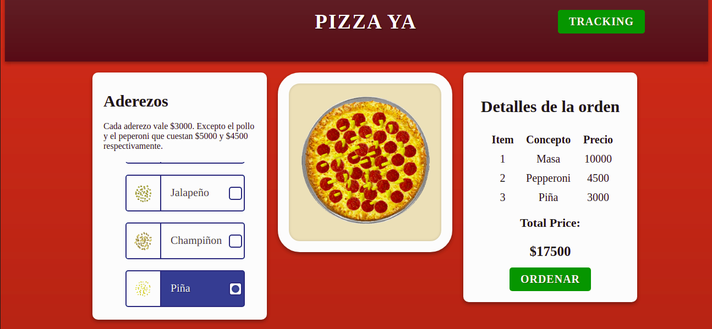
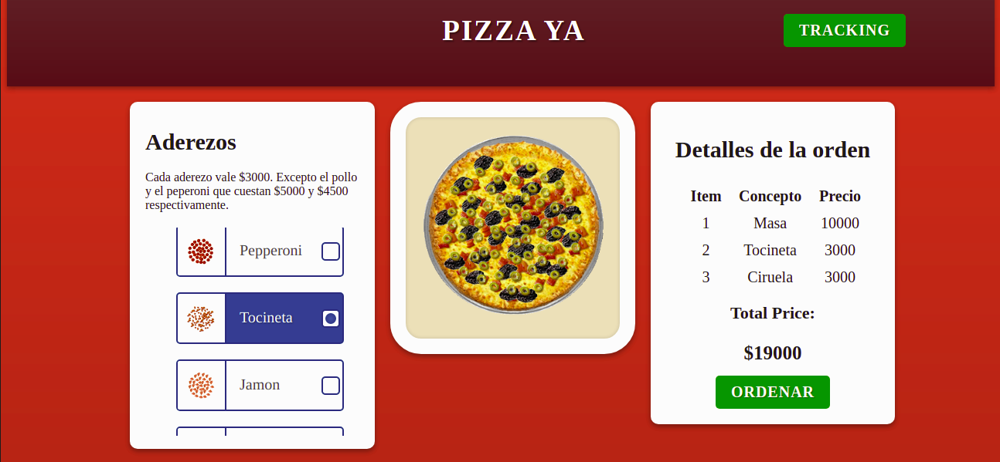
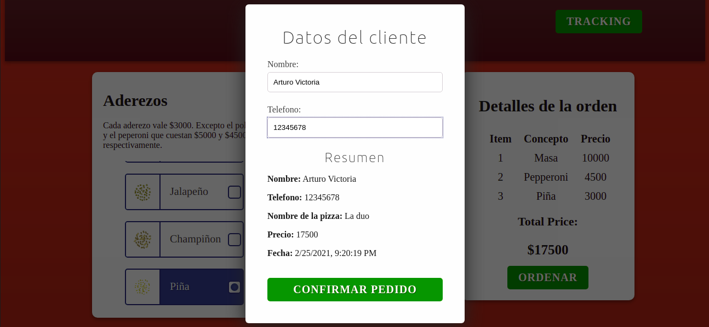
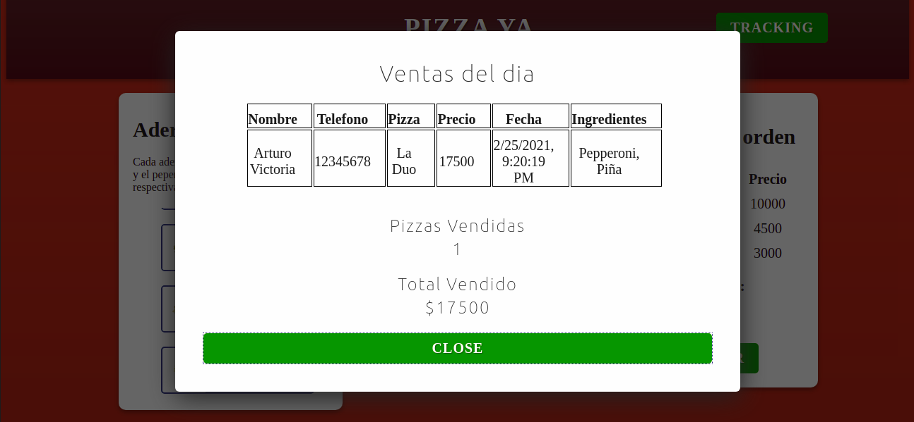

# PizzaYa



## Description :book:

Daily Tracking Pizza.

## Installation :floppy_disk:

In Ubuntu 20:

0. Install nodejs and npm:

```console
foo@bar:~$ apt install nodejs npm -y
```

1. Go inside the folder PizzaYa:

```console
foo@bar:~$ cd PizzaYa
```

2. Install the node modules:

```console
foo@bar:~/PizzaYa$ npm install
```

3. Run the service:

```console
foo@bar:~/PizzaYa$ npm start
```

## Usage :open_file_folder:

1. Choose the ingrients of the pizza in the "Aderezos" section and make an order in the "Detalles de la Orden" Section.


2. Type your name and your phone for completing the order.


3. Watch the daily orders in the traking button.


## Support :email:

LinkedIn:

- [Arturo Victoria Rincon](https://www.linkedin.com/in/arturovictoriar/)

Twitter:

- [Arturo Victoria Rincon](https://twitter.com/arturovictoriar)

Portfolio website:

- [Arturo Victoria Rincon](http://arturovictoriar.github.io/)

## Authors and acknowledgment :school:

Arturo Victoriar Rincon is a software engineer with over 2 years of experience in fields like Web, IoT and AI. Proven assertive communicator after 1 year of working with blind people.
Looking to contribute web and machine learning projects.

## License :warning:

:copyright: 2021 All rights reserved.

## Project status :white_check_mark:

The PizzaYa platform should improve the css in the follow-up views and confirm order. It's need split the service in components.

## Author :black_nib:

* __Arturo Victoria Rincon__ <[arturovictoriar](https://github.com/arturovictoriar)>